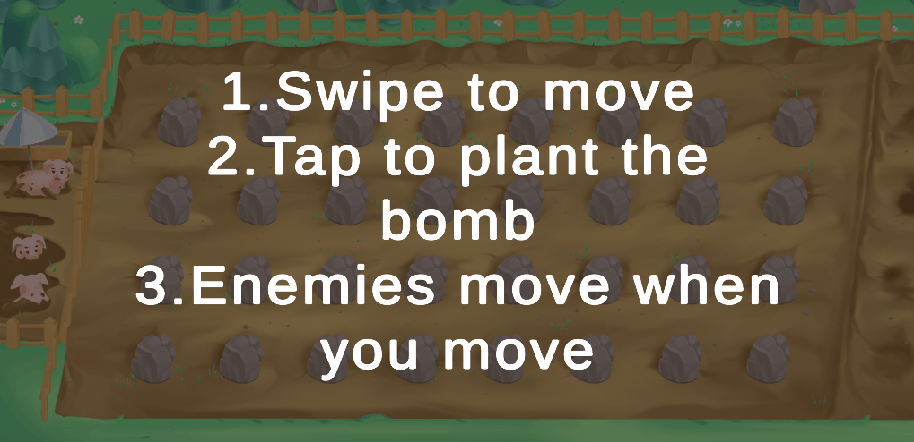

# BomberPig
Tестовое задание:

# Общее описание:
* требуется создать игру на Unity и предоставить результат в соответствии
с требованиями;
* в рамках тестового задания должна быть создана одна сцена;
* в рамках тестового задания можно пользоваться как следующими
ассетами:https://clck.ru/PygSX, так и любыми своими;
* на карте должны быть расставлены камни согласно образцу, ассеты - на
ваш выбор:

# Что нужно реализовать:
* игрока представляет свинья;
* передвижение игрока по уровню;
* установку бомбы;
* любого противника с несложным поведением (например, случайное
передвижение по уровню);
* взаимодействие бомбы с противниками и главным персонажем -
свиньёй;
* возможность управления с мобильного устройства (смартфона);
* дополнительный функционал на ваше усмотрение, мы всегда за новые
идеи.

# Сроки выполнения:
* 3 дня.

# Будет оцениваться:
* нам интересно посмотреть, какую реализацию взаимодействий между
объектами предложите вы. Креатив приветствуется! :)

# Скриншоты:

  

# Project Structure
    |-- Assets
        |-- Datas
        |-- Materials
        |-- Plugins
        |-- Prefabs
        |-- Resources
        |-- SandBox
        |-- Scenes
        |-- Scripts
        |   |-- Editor
        |-- Sprites

# APK
https://drive.google.com/file/d/1btApEjToPPEIw_u_PVpm9vnj-2P4FK8C/view?usp=sharing

# Плагины, использованные в проекте:
* DOTween
* TextMeshPro